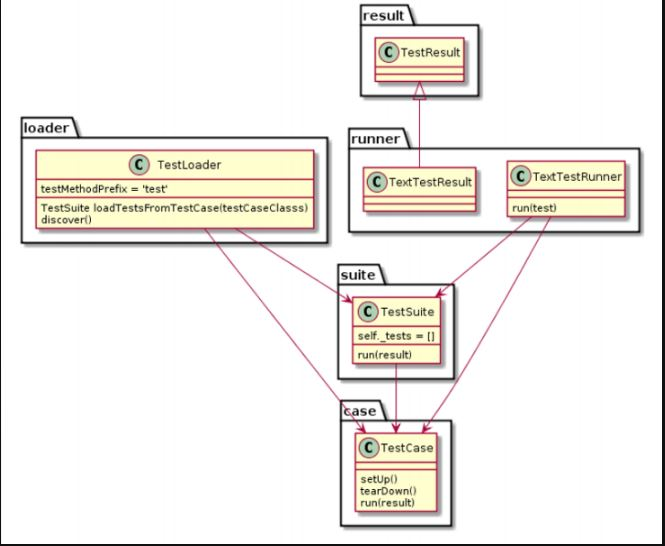

# unittest_base
##unittest基础使用方法
###1.基本概念：test case；test suite；testLoader；test runner；test fixture。   
    
###Testcase：    
1.一个 testcase 就是一个测试用例。Setup（测试环境的准备）、run（测试 执行）、teardown（测试环境的还原）。    
2.测试方法的名称要以test开头。且只会执行以test开头定义的方法（测试用例）。    
###Testsuite（集合或套件）：     
1.多个测试用例的集合就是 suite，一个 suite 可以包含多个 测试用例，也可以嵌套 suite。    
###testLoader：用来加载 testcase 到 testsuite 中的，其中loadTestsFrom__()方法用于寻找TestCase，并创建它们的实例，然后添加到TestSuite中，返回TestSuite实例；    
###testrunner：用例执行测试用例（run 方法），测试结果会保存在 Testresult 中。
###fixture：一个测试用例环境的搭建和销毁。
###注意：    
一个 class 继承了 unittest.TestCase，便是一个测试用例，但如果其中有多个 test开头的方法，那个每一个test开头的方法，在load的时候，便会生成一个testcase 测试用例。

举例： 一个 class 中有 3 个test_*的方法，最后在 load 到 suite 中，就有 3 个测试用例。

##脚本说明：    
1.测试Log生成：unittest_output_beautifulreport_ex1.py，unittest_output_HtmlTestRunner.py，unittest_output_txt.py    
2.测试结果信息收集：unittest_result_message_base.py，unittest_result_message_bf.py    
3.跳过用例：unittest_skip_case.py  
4.统计失败用例名，并将失败用例重跑方法？（精确筛选执行用例）  unittest_discover_base.py  
